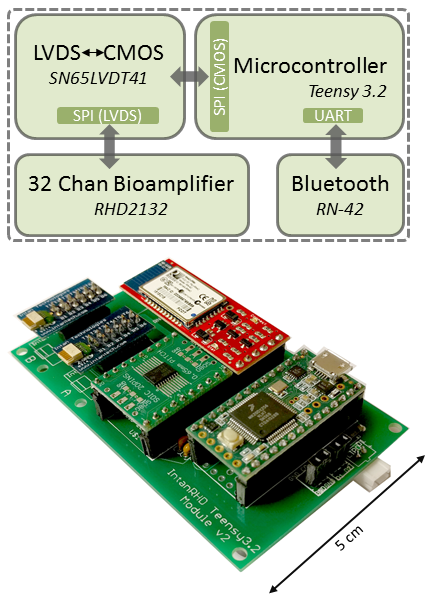
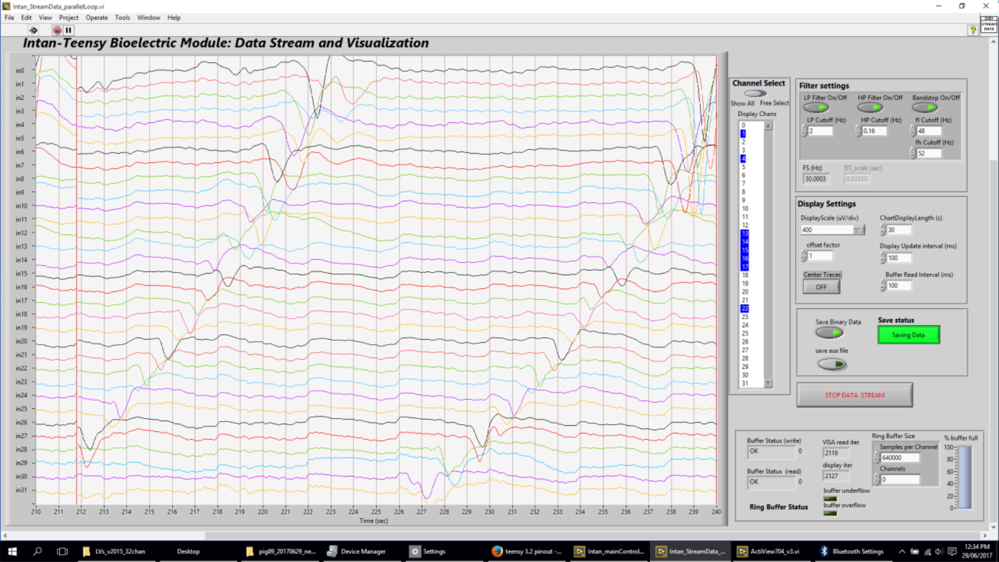

# Intsy
32/64 channel bioamplifier system, now with accelerometer and on-board SD data logging capability for ambulatory applications (as of Dec 2018)! Photos of the updated device are below.

Intsy is a new low-cost, open-source, wireless-enabled bioamplifier system.  The system can be configured for 32 or 64 channel operation.  It has been validated for gastrointesinal slow wave recordings and surface EMG. Full details are provided in our <a href =  "http://iopscience.iop.org/article/10.1088/1361-6579/aaad51">recently published peer-reviewed article</a>.

Data can be streamed either wirelessly via bluetooth or in wired configuration over USB.  A LabView interface allows for real-time visualization and saving to hard disk for off-line analysis.  Data rates of 32 chan x 110 Hz can be stably transmitted over bluetooth.  The USB wired configuration can achieve up to 2 kHz x 32 chan.  

The name Intsy comes from the two core components: Intan RHD2132 bioamplifier chip + Teensy 3.2 microcontroller.

Please see "Intsy_Setup_Guide.pdf" for detailed instructions on how to set up the Intsy system. Assembly time is typically about 2-4 hrs.  Total cost is about $1500 for the 32 channel system and about $2400 for the 64 channel system.  That means in just half a day you can build your very own high-quality, low-cost, portable bioamplifier system!

All feedback and suggestions are warmly welcomed. 

  

Above: Intsy hardware architecture and device

  

Above: Intsy v2: accelerometer and SD card logging enable ambulatory applications. The updated module uses an ADXL335 and Teensy 3.6. A 1-cell LiPo battery port with built-in switch powers the module. 

  

Above: Screenshot of Intsy Labview front end to visualize and stream signals in real time.

<b>Disclaimer</b>

The Intsy electronics module is not a medical device nor is it intended for medical diagnosis and provided to you "as is," and we make no express or implied warranties whatsoever with respect to its functionality, operability, or use, including, without limitation, any implied warranties, fitness for a particular purpose, or infringement. We expressly disclaim any liability whatsoever for any direct, indirect, consequential, incidental or special damages, including, without limitation, lost revenues, lost profits, losses resulting from business interruption or loss of data, regardless of the form of action or legal theory under which the liability may be asserted, even if advised of the possibility of such damages. This bioamplifier module does not fall within the scope of the European Union directives regarding electromagnetic compatibility, restricted substances (RoHS), recycling (WEEE), FCC, CE or UL, and therefore may not meet the technical requirements of these directives or other related directives
